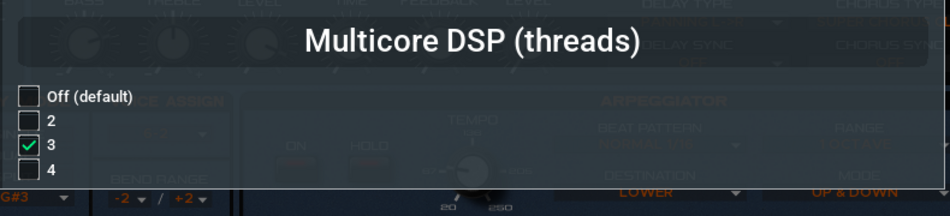

# Upstreaming to dsp56300/gearmulator

Status 2026-09-03. Branch `rebase-onto-upstream`, on upstream `c5dddcd0`, tagged
`upstream-rebase-2026-09-03`. Everything below was measured on a Raspberry Pi 4B
rev 1.5 @ 1.8 GHz, Debian 13 arm64, PSU + wifi, `throttled=0x0` verified before
and after each run.

## What we have

Two independent pieces of work.

**A. Engine optimizations** — always on, bit-exact, help any host. Timer event
horizon, H8S page-mapped memory access, ESP per-core dirty tracking, asmjit
Assembler instead of Builder, dense ARM64 emitter.

**B. A parallel ASIC pipeline** — opt-in, off by default. The JP-8000 chain is
four ASICs in series, so it does not parallelise by splitting a sample across
cores; it PIPELINES, one stage per core, each handing its neighbour the GRAM
words that cross the boundary. Throughput is bounded by the slowest stage rather
than their sum.

## The numbers

Steady-state, boot excluded (see *Measurement traps* below):

| Configuration | RT factor | vs previous |
|---------------|-----------|-------------|
| Stock upstream, serial | 0.433x | — |
| + engine optimizations | 0.800x | **1.85x** |
| + 4-stage pipeline, through `Device` | **2.26x** | **2.98x** |
| **Total** | | **5.2x** |

Engine-level (`bench_je*`, excludes Device):

| | serial | 2 stages | 3 stages | 4 stages |
|---|--------|----------|----------|----------|
| fork | 0.85x | 2.06x | 2.58x | 2.94x |
| threads | — | 2.01x | 2.62x | 2.92x |

Threads match fork at every depth. The pipeline ceiling is set by stage 0
(H8S + ASIC0) at 3.76 us/sample against an 11.34 us budget: 11.34/3.76 = 3.02x,
which is what four stages deliver. Splitting the H8S from ASIC0 is the only way
past it.

**The gains are architecture-specific.** The same engine optimizations measured
on Apple Silicon: 6.92x -> 6.93x, i.e. nothing. A narrow in-order-ish core with
slow memory pays for the per-instruction timer loop, the pointer-table
indirection and the extra ESP loads/stores; a wide out-of-order core absorbs
them. Do not quote 1.85x to a desktop reviewer. x86 desktop is UNMEASURED.

## Correctness evidence

- Engine optimizations: 5 of 6 corpus scripts byte-identical before/after
  (`tools/ab/bitexact.sh`). The sixth, `performance_select`, is excluded as
  nondeterministic in the render path, independent of our changes.
- Pipeline: the raw ASIC3 tap is byte-identical to serial and identical across
  runs; the wav is the serial stream delayed by a fixed 3 frames (0.034 ms).
- Determinism required a FIXED delay, not a bounded one. See below.
- Cross-platform: `sustained_c4` hashes the same on macOS/arm64 and Linux/arm64,
  so a reviewer can reproduce a hash rather than take our word.

## Decisions for the upstream patch

**Drop core pinning entirely.** It buys nothing and it is what breaks multiple
instances. Measured on an idle Pi, two runs each:

| configuration | run 1 | run 2 |
|---------------|-------|-------|
| 3 stages, pinned 1,2,3 | 1.8x | 1.8x |
| 3 stages, unpinned | 1.7x | 1.8x |
| 2 stages, pinned 0,1 | 1.7x | 1.5x |
| 2 stages, unpinned | 1.7x | 1.7x |

Identical within noise, and the pinned 2-stage case was WORSE once. Meanwhile
`core(s)` indexes the list by stage and the env is process-wide, so two
instances pin to the same cores; two instances only run with pinning off. No
environment variable can express per-instance affinity, so this cannot be fixed
as an env var -- it just goes.

**Drop the env opt-in too; use the config the plugin already has.** The claim
"a plugin has no other way to be told" was wrong. `jePluginProcessor.cpp`
already does `getConfig().getIntValue("latencyBlocks", ...)` -- per-instance,
persistent, and surfaceable in the UI, which is everything the environment is
not. `jeLib` keeps `Je8086::requestParallelPipeline(...)` as the API and the
CALLER decides; the env parsing in `device.cpp` stays local and never enters the
PR.

**`PerformanceControlChannel: sendChange(0x11)` -- submit it, but ask rather than
assert.** The comment says "off" and off for this parameter is `0x10`; `0x11` is
the encoding of the parameter next door (`RemoteControlChannel`, "1-16, All,
Off"). It has no entry in `parameterDescriptions_je.json`, so the only range
evidence is the header comment plus our own probing, and the firmware knowledge
is theirs. Frame as "this looks wrong, here is the measurement, please confirm".

## The Multicore DSP setting -- IMPLEMENTED, uncommitted in the submodule

Written 2026-09-04 and building at time of writing. This is the "belongs in the
plugin's own settings" that `jeLib/device.cpp` asked for in its own comment.

It follows `canModifyDspClock()` exactly: the DEVICE declares the capability, and
the SHARED DSP/Audio settings panel shows the control when the capability is
there and hides it otherwise. That precedent matters for the PR -- it is the
house pattern for a device-specific control in a shared panel, and it is in the
same file we are editing.

| file | change |
|------|--------|
| `framework/synthLib/device.h` | `DeviceCreateParams::dspThreads`; `virtual uint32_t getMaxDspThreads() const { return 1; }` |
| `ronaldo/je8086/jeLib/device.h/.cpp` | override -> 4; pipeline built from `_params.dspThreads`; `pipelineDelay()`; both latency getters |
| `framework/juce/jucePluginLib/processor.h/.cpp` | `getMaxDspThreads()` proxy, `getDspThreads()`, `virtual setDspThreads()`, `m_dspThreads` |
| `framework/juce/jucePluginEditorLib/pluginProcessor.h/.cpp` | `setDspThreads` override persisting to config -- a line-for-line mirror of `setLatencyBlocks` |
| `ronaldo/je8086/jeJucePlugin/jePluginProcessor.cpp` | reads `dspThreads` config in ctor; sets `params.dspThreads` in `createDevice()` |
| `framework/juce/jucePluginEditorLib/settingsDspAudio.h/.cpp` | the control + `updateDspThreadButtons()`; hidden unless `getMaxDspThreads() > 1` |
| `framework/juce/jucePluginData/tus_settings_dspaudio.rml` | `containerDspThreads` + clonable `dspThreadsEntry` row |

**The UI reads:** heading `Multicore DSP (threads)`, options `Off (default)`,
`2`, `3`, `4`. Value 1 is skipped -- one thread IS Off, and offering both would
be two labels for one state.

Screenshots for the PR, taken from the CLAP in REAPER on the Pi:
`docs/images/multicore-dsp-setting.png` (the control),
`multicore-dsp-settings-page.png` (in context under Latency / Output Gain /
Resampler) and `multicore-dsp-warning.png` (the warning on change).

**Reaching it: right-click the plugin background > Settings... > DSP & Audio,
and tick "Enable Advanced Options".** The section carries
`class="settings-advanced"`, copied from the DSP Clock container, so it is
hidden until advanced options are on -- and turning those on raises its own
"may cause instability" confirmation. That is defensible (DSP Clock, the closest
analogue, is also advanced) but it is a real decision: on an SBC this setting is
the difference between unusable and usable, and burying it behind two
confirmations is friction for exactly the user who needs it.

DECIDED 2026-09-04: leave it advanced, raise it in the PR rather than settle it
here. Note that NEITHER the checkbox nor its confirmation is ours -- the
"Changing these settings may cause instability" box is dsp56300's, in
`settings.cpp` (`fb01c9dda`, file untouched by us), and `settings-advanced`
already gated `containerDspClock` in the same rml before we edited it. Our diff
to that file is +14/-0. So the question upstream is only "is this an advanced
setting", and dropping one class attribute moves it beside Latency with no gate.

**Verified end to end, not just rendered:** clicking `3` checks it, clears
`Off`, raises the warning, and writes `dspThreads" val="3"` into
`.local/share/The Usual Suspects/JE8086/config/JE8086.xml`, which is what
`createDevice()` reads back into `params.dspThreads`.

**"threads" not "cores" was a deliberate choice** and is worth arguing in the PR
rather than settling here. Users think in cores; the code thinks in stages, and
they are 1:1 in practice but not by definition.

**Per-option hints were REMOVED on purpose.** An earlier draft read
`3 (recommended: leaves a core for the host)`. That advice encodes our four-core
Pi, and this panel is shared by every synth on every machine, where it would be
wrong. If we want guidance it belongs in documentation, not in a shared label.

**Changing it shows a warning and takes effect on reload**, because the thread
count is fixed at device creation -- it determines the reported latency, and a
plugin that changes latency mid-session breaks hosts. Same reasoning, and nearly
the same wording, as the existing Latency buttons.

**THE ENV BRANCH MUST BE STRIPPED FROM THE PR.** `jeLib/device.cpp` now reads:

    if (_params.dspThreads > 1)        <- upstream path, keep
        ...
    else if (getenv("JE_PIPELINE"))    <- local only, DELETE for upstream

The `else if` is what keeps our Move build, `bench_je*`, `jp8000_render`,
`jp8000_live` and `play.sh` working, none of which go through plugin settings.
Deleting it upstream is the whole point of PR 9's "no env vars" decision, and
forgetting to delete it would ship exactly the interface we argued against.

**Delay dropped from 64 to 2 samples** (`g_pipelineDelaySamples`), the minimum
that covers the samples in flight. Our tooling passed 64 explicitly and no
longer does.

**Nothing here is committed.** The gearmulator submodule's own CLAUDE.md says
"Do NOT commit without explicit user approval" and "Do NOT include
Co-authored-by trailers" -- both apply to every commit we make in that tree, and
the second differs from this repo's convention.

## The PRs

Ours are bundled by discovery order, not by what upstream should review, so most
of these need a commit split rather than a cherry-pick. `787c8dfe` alone carries
four separate candidates.

### 1. `setFlushDenormalsToZero()` is a no-op outside MSVC
`framework/baseLib/os.cpp`, ~10 lines. `HAVE_SSE` is never defined project-wide
(only locally inside `rmlRendererJuce.cpp`), so denormal flush was never enabled
on any Linux or macOS build, x86-64 or ARM, for any device — Virus included.
Key the SSE path off `__SSE__`, add the aarch64 FPCR FZ path.

Lead with this one: it is a real bug in their code, needs no JP-8000 knowledge,
and is unrelated to everything else. Split it out of `04098db8` — the
`base.cmake` flags and `dspSingle.cpp` sleep beside it are Move-specific.
The same dead gate in `filesystem.cpp` and `synthLib/os.cpp` only guards an
`#include`; mention it, do not widen the PR.

### 2. Remove the MIDI-out `printf`
`cpu/h8s/h8sdevices.hpp`, 5 lines. A `write()` syscall per MIDI byte from the
emulation thread, in two places. Ships as-is.

### 3. H8S page bitmap
`cpu/h8s/h8s.hpp`. Every instruction fetch previously probed a 16 M-entry
pointer table; an 8 KB bitmap answers first. Bit-exact.

### 4. H8S wide-access fast path
Same file, separate PR so each is judged alone. 16/32-bit accesses that lie in
one unmapped page read `memory[]` directly. **The per-byte `clockMem()` calls are
kept verbatim, so cycle counts — and the ASIC sample cadence — are unchanged.**
Put that sentence in the commit message; it is what earns the merge.

### 5. Timer event horizon
`cpu/h8s/h8sdevices.hpp` + `instrStartCycles` in `h8s.hpp`. The largest single
engine win. Nothing observable happens between compare-match/overflow/IRQ
events, so skip to the next one; register accesses catch up first.

Correctness argument, verified: `timers.tick()` runs AFTER `emu.step()`, so the
old code updated to end-of-instruction cycles, and `catchUp()` uses
`instrStartCycles`, which is exactly that point. Deferred increments equal
per-instruction ones because `inc` is a difference of floors, additive across
any split. Pre-empt two questions: the skip conditions in `update()` and in the
`nextEvent` recompute must stay in lockstep, and `write()` resets `nextEvent`.

### 6. `a64::Assembler` instead of `a64::Builder`
`esp/esp_jit_types.h`, `esp/esp_jit_arm64.h`. Six lines. The ESP program is
straight-line with no labels or node edits, so it is a drop-in with identical
encodings; `Builder::finalize()` was re-walking every node. Clean up first:
`m_asm.finalize()` is guarded by `#if JIT_X64`, which keys off the architecture
rather than the builder type.

### 7. ESP per-core dirty tracking
`esp/esp_opt.hpp`, `esp/esp.hpp`, `jeLib/je8086devices.h`. The change is ~15
lines: a `cores` mask threaded through `setProgramDirty`/`genProgram` and the two
`writeuC` call sites, where core 0 owns `intmem` words `0..0x3ff` and core 1 the
rest. Everything else in that hunk is instrumentation and stays here. Comment the
0x56 path's straddling mask.

### 8. Dense ARM64 emitter + ring mirror
`esp/esp_jit_arm64.cpp`, `esp/esp_opt.hpp`, `esp/esp.hpp`. The only change that
alters generated-code semantics; expect the most review.

Lead with `coefsShifted`, which is easy to defend: `shiftAmount` is one of
{3,5,6,7}, `coef` is `int8`, so `coef << 4 <= 2032` fits `int16`, and
`(P << (7-s)) >> 7 == P >> s` exactly under arithmetic shift.

Settle before submitting: `nextIsDmac` uses the next statically emitted op,
consistent with the existing design (`esp_opt.hpp` already declares jumps
unsupported — offer our runtime check for that, it was an `assert` compiled out
under `-Ofast`); `jitEnter` zeroes `last_mulInput{A,B}_24` where the interpreter
carries them, not a regression and measured unreachable across the corpus; keep
`ESP_IRAM_MIRROR` unconditional, upstream will not want two ring layouts by
architecture. The x64 emitter takes `nextIsDmac` and ignores it — say so.

### 9. Parallel ASIC pipeline
`jeLib/jePipeline.{h,cpp}`, `jeLib/je8086.{h,cpp}`, plus the stage-scoped
`thread_local` state and hooks in `jeLib/je8086devices.h`.

**Open an issue first.** This is a design conversation, not a drive-by patch: it
adds threads to a device library, and the answer may be "yes, but through
`clap.thread-pool`" or "yes, but block-level". Pitch it as what it is — the
difference between 0.8x and 2.26x on an SBC, off by default, nothing changed for
anyone who does not ask.

Three things reviewers will and should ask:
- **Why not fork?** A plugin cannot fork. Threads also removed the ragged
  shutdown fork had.
- **Is it exact?** Yes, with a FIXED delay. A bounded window is not enough:
  how far the H8S actually leads still depends on thread timing, so runs differ
  (three runs at window 4 gave three hashes). Delivering one sample per sample
  rendered, taken a constant number of samples late, ties output to counters
  alone. Two samples of delay suffices — it only has to cover samples in flight.
- **Multiple instances?** The stage state is `thread_local`, which is correct
  per stage but has never been tested with two JP-8000s in one process. Be
  honest about that.

## Not upstreaming

- **The fork pipeline** and its Move-specific machinery: `g_je_parallel_mode`
  file-scope globals, the shm rings, the `flock`, FIFO 20 clamping, core pinning
  for Move's layout. The threaded pipeline is the upstreamable form.
- **`base.cmake` `-funroll-loops -fomit-frame-pointer`** — global codegen flags
  on top of `-Ofast` with no per-change measurement.
- **`dspSingle.cpp` yield -> `usleep`** — a Move RT workaround that slows Virus
  boot for everyone. The busy-yield on a boot wait thread is worth an issue.
- **Snapshot v2** — a feature, not a perf fix: bespoke `FILE*` format, no
  in-class versioning, unchecked `fread`/`fwrite`. Propose before writing.
- **The test corpus and `bitexact.sh`** cannot go as-is: they drive
  `jp8000_render`, which depends on our snapshot support. The evidence comes
  from us running it, not from them. Porting a minimal renderer onto
  `jeTestConsole` would change that, and would be a genuine contribution.

## Known gaps — disclose these

- **The pipeline delay is not reported to the host, and `getExtraLatencySamples()`
  is the WRONG hook** -- it is the getter for what the host already set via
  `setExtraLatencySamples()`. The right place is
  `Device::getInternalLatencyMidiToOutput()` (currently a flat 4.5 ms) and
  `getInternalLatencyInputToOutput()` (not overridden by je8086), which is what
  `Plugin::updateDeviceLatency()` actually reads. Two lines. Fix it BEFORE
  submitting rather than disclosing it: "we add latency and do not report it"
  sinks a plugin PR on principle. Note the delay only needs to be 2 samples for
  determinism -- our default of 64 is arbitrary and should drop to the minimum
  upstream, which makes the question nearly moot.
- **x86 desktop is UNMEASURED, and we ship it that way.** DECIDED 2026-09-04:
  disclose rather than measure. We have no x86 hardware; the routes to a number
  were a shared CI runner (noisy, and `bench_je` needs the copyrighted ROMs --
  635 KB against a 64 KB secret limit) or renting a VM, and neither buys enough
  to delay on. Do NOT reach for Docker x86_64 on Apple Silicon: that is
  Rosetta/QEMU translation, its timings say nothing about native x86, and it
  would hand us a confidently wrong number of exactly the kind that has cost us
  most.

  Wording ready to paste into the PR:

  > Measured on ARM: 1.85x on a Cortex-A72 (Pi 4B @ 1.8 GHz), and ~0 on Apple
  > Silicon -- a wide out-of-order core absorbs the per-instruction timer loop,
  > the pointer-table indirection and the extra ESP loads/stores that an A72
  > pays for. x86 is untested; I have no x86 hardware. I would expect it nearer
  > the Apple Silicon end than the A72 end, so treat this as an
  > in-order/narrow-core win rather than a universal speedup. The changes are
  > bit-exact either way, so if x86 gains nothing the result is neutral, not
  > negative.

  That framing is honest and is also the strongest available: it pre-empts the
  reviewer's first question, and "bit-exact, so neutral at worst" is the real
  argument for merging something whose benefit they cannot reproduce.
- ~~Two instances in one process is untested~~ -- MEASURED: two work at 2
  stages each with pinning disabled, three do not. See above. The remaining
  issue is that `JE_PIPELINE_CORES` cannot express per-instance affinity.
- `performance_select` remains nondeterministic in the render path; the fixed
  delay work suggests why (unbounded run-ahead) but it has not been retested.

## Measurement traps

**Size the pipeline to leave the HOST a core.** On a 4-core Pi at 48 kHz/1024,
serial is 0.7x, three stages 1.8x, and four stages **1.5x** -- four is slower
than three, because the fourth stage takes the core the host's own audio thread
and GUI need. The Ardour launch scripts pinned four stages to cores 0,1,2,3 and
the result was continuous starvation: Ardour sat at 185% CPU with the Pi at
80.8 C and `throttled=0x80000` (soft temperature limit tripped). Starvation that
deep is heard as PITCHED-DOWN AND SLUGGISH audio, which sounds exactly like a
sample-rate mismatch and is not one.

**Rule out the rate mismatch by measuring pitch, not by listening.** The device
advertises a single supported samplerate (88200), so `getDeviceSamplerate()`
cannot return anything else and the resampler cannot be bypassed -- but that is
an argument, not evidence. The evidence is rendering the same MIDI through the
CLAP at 48 kHz and 88.2 kHz, serial and at 2/3/4 stages, and measuring the
fundamental: all five give E4 at 330.5 Hz (MIDI 64.04) with matching peaks. A
patched `clap-trap notes` (its `-o` writes no audio upstream) does this headless.

**The plugin runs clean in a DAW, with the pipeline sized to leave a core.**
Ardour 8.12 on the Pi, session loaded, engine running, three stages on cores
1,2,3 at `JE_PIPELINE_RTPRIO=70` (below Ardour's own audio thread at 78),
48 kHz / 1024 frames / 3 ALSA periods. Measured from `/proc/<tid>/stat` over
10 s: stage threads 67.5% / 67.4% / 44.3% of a core, Ardour's RT-main 13.1%,
**0 xruns** over two minutes, 71 C. No stage saturated.

**`ps` %CPU is a LIFETIME AVERAGE and re-runs the boot trap.** The same process
read 187% from `ps` and ~18% instantaneous moments after startup, because the
plugin's ~60 s of snapshot load and JIT warm-up is averaged in forever. Use
`top -H` deltas or `/proc/<tid>/stat`, not `ps`.

**Ardour can be driven headlessly, which is how the above was measured.** It
never saved engine settings (`<AudioMIDISetup/>` stayed empty through every
kill), so it re-prompted every launch. Writing an `<EngineState backend="ALSA"
... n-periods="3"/>` under `<AudioMIDISetup><EngineStates>` in
`~/.config/ardour8/config` plus `try-autostart-engine=1` starts the engine with
no dialog. One gotcha: a previous kill leaves a `<session>.pending` file and
Ardour then blocks on a **Crash Recovery** dialog before loading anything --
under Xvfb that looks like a hang. `xdotool search --name . getwindowname %@`
names the blocking window.

**BOTH FORMATS RUN LIVE IN REAPER. This is the headline evidence for PR 9.**
Verified 2026-09-04 on the Pi 4B, REAPER 7.39 aarch64, ALSA plughw:0,0, 3
periods, RT priority 70, played from an Arturia Minilab3.

Offline render through REAPER (`-new script.lua`, ReaScript builds the project
and renders, so the verdict is a wav and not a meter), same C-major chord:

| format | duration | peak | rms | fundamental |
|--------|----------|------|-----|-------------|
| VST3 | 7.00 s | 0.332 | 0.097 | 261.9 Hz = MIDI 60.02 |
| CLAP | 7.00 s | 0.353 | 0.099 | 261.9 Hz = MIDI 60.02 |

REAPER finds both formats unaided (`reaper-clap-linux-aarch64.ini` and
`reaper-vstplugins_arm64.ini` after one launch) -- no manual scanner run, unlike
Ardour.

Live, one instance, 3 stages pinned to cores 1,2,3 (core 0 left to REAPER):
stage threads 68.7 / 68.6 / 47.3 % of a core, REAPER ~33%, total 212% of 400%.
User-confirmed playing with no audible underruns.

**Two instances fit; three do not.** Concurrent `clap-trap bench`, idle box,
48 kHz / 1024, each column one instance (>= 1.0x means it keeps up):

| configuration | per-instance RT factor |
|---------------|------------------------|
| 1 x 2 stages | 1.7x |
| 1 x 3 stages | 1.8x |
| **2 x 2 stages** | **1.3x, 1.3x** |
| 2 x 3 stages | 0.8x, 1.1x |
| 3 x 2 stages | 0.8x, 0.6x, 0.7x |

Confirmed in REAPER, both instances armed and audible: stage CPU 83.2/61.0 and
83.2/61.0, total 302% of 400%, REAPER's Performance Meter steady at 75%
(range 73-77%), user-confirmed clean. **This closes the "two instances in one
process is untested" gap** listed under Known gaps.

**`JE_PIPELINE_CORES` IS PROCESS-WIDE AND MUST BE FIXED BEFORE PR 9.**
`core(s)` indexes the list by STAGE, so two instances in one host both pin to
the same cores and leave the rest of the machine idle. Two instances only work
with the variable UNSET (`pinCore(-1)` no-ops). An env var cannot express
per-instance affinity; either drop pinning from the upstream patch or move it
behind an API the host drives.

**Load is flat: notes cost ~5%.** 297% silent vs 302.5% with a chord held. The
emulator runs the whole H8S + 4 ASICs continuously, so there is no polyphony
spike -- worth stating in the PR, it is unusual and it makes the budget easy.

**A host's per-plugin CPU readout badly understates this plugin.** REAPER shows
each instance at 3.3% FX CPU while it actually costs ~1.4 cores, because REAPER
only times what happens inside `process()` on its audio thread and the pipeline
does the work on its own threads. Quote the host's OVERALL cpu figure, never the
per-FX one. (This is also an argument reviewers may raise against the design.)

**Two more upstream bugs found, both in `jeController.cpp`, both from
`902d06adc` (dsp56300, "merge JE8086"), verified an ancestor of
dsp56300/gearmulator main:**
- `PerformanceControlChannel: sendChange(0x11)  // off` -- 17 is out of range for
  a parameter documented "1 - 16, Off", so the firmware rejects it and the
  channel stays on 16. `RemoteControlChannel` next door genuinely does take 17,
  which is what makes them look interchangeable.
- `RemoteControlChannel` is set to 0 ("channel 1") for a new savestate while the
  code comment says "Set remote channel to 3" and the JSON `default` is 2 ("3").
  Channel 1 collides with the Upper part, which also defaults to MIDI CH 1, so
  channel 1 is consumed by the remote/keyboard path -- it goes through KEY MODE
  (SPLIT) and the arpeggiator instead of addressing Upper directly. Setting it
  to 3 gives the clean Upper=1 / Lower=2 / remote=3 layout the comment intended.
These are small, independently verifiable, need no JP-8000 performance
knowledge, and are good early PRs.

**OPEN: the VST3 produces SILENCE in Ardour, and it is not the pipeline.**
The plugin loads, its GUI is alive (LCD reads the loaded performance, ROM
loaded), Ardour's MIDI meter shows notes arriving at velocity 100 -- and the
track's audio peak stays at -inf. Reproduced with the pipeline at 3 stages AND
with `JE_NOPIPE=1` (serial, one JeThread), so our parallel work is exonerated.
The same plugin as CLAP in clap-trap renders correct-pitch audio at 48 kHz in
every configuration, so it is specific to the VST3-in-Ardour path. Not root
caused. Earlier in the day the same VST3 did emit (pitched-down) audio in
Ardour, so it is not a permanent property of the binary.

Two dead ends recorded so they are not re-run: the missing `Latency set to N
samples at 88200 Hz` / `Resampler input latency` lines in Ardour's log are NOT
evidence the resampler is unconfigured -- they are stdio buffering in a host
that never exits, and the plugin window displays a computed 25.81 ms latency,
which only `updateDeviceLatency()` produces. And `setLogFunc(&noLoggingFunc)`
in `pluginProcessor.cpp` is behind `#ifdef ZYNTHIAN`, so it is not suppressing
them either.

**Ardour operational traps, all self-inflicted and all costly.**
- `ps` %CPU is a LIFETIME AVERAGE; it read 187% where `top -H`/`/proc` read 18%,
  because the plugin's ~60 s JIT warm-up never ages out. Use `/proc/<tid>/stat`.
- Swapping the `.so` inside a `.vst3` bundle poisons `~/.cache/ardour8/vst/*.v3i`
  and writes `scan-result="2"` into `plugin_metadata/scan_log`; Ardour then says
  **Missing Plugins** even after the original binary is restored. Ardour's own
  in-process scan keeps failing; running
  `LD_LIBRARY_PATH=/usr/lib/ardour8 /usr/lib/ardour8/ardour-vst3-scanner -f <bundle>`
  succeeds and rewrites the cache. Never leave a second `.so` in the bundle.
- `plugin-scan-timeout` defaults to 150 = **15 s**; this plugin needs ~60 s to
  instantiate.
- Killing Ardour leaves `<session>.pending`, and the next launch blocks on a
  **Crash Recovery** dialog that under Xvfb looks exactly like a hang. Check with
  `xdotool search --name . getwindowname %@`.
- A truncated port label lies: `Minilab... LV (In)` is `Minilab3 **ALV**`, an
  Arturia control port that carries no keys, not `Minilab3 MIDI`.

**The headless path is verified end to end.** `jp8000_live` with MIDI fed through
a FIFO and audio teed to a file by an ALSA `type file` plugin -- no keyboard and
no listener required -- renders E4 at MIDI 63.95 with **0 xruns**, block time
p50 1.27 ms / p99.9 1.60 ms against a 2.90 ms budget. One artifact to chase:
a 105-sample full-scale burst at 0.305 s, at boot, before any note.

Three real mistakes made while producing the numbers above. Anyone continuing
this should know them.

**Time renders WITHOUT boot.** A `jp8000_render` run carries ~1.0-1.4 s of
snapshot load and JIT warm-up. Timing whole processes folded that into the rate
and understated everything: the engine optimizations read 1.74x when they are
1.85x, and the pipeline read 1.28x when it is 2.26x. Render 1 s and 9 s and take
the slope.

**Profile before believing an arithmetic story.** A plausible per-sample cost
model pointed at `JeThread`'s semaphore ring and produced a confident "batching
it is the next big win". `perf` said 64% `[JIT]`, 32.5% binary, **2.78% kernel** —
the ring cannot cost what the model claimed, and `SpscSemaphoreWithCount` is a
single atomic unless a waiter is actually blocked. The whole premise was the boot
artifact above.

**A dev Mac cannot see these gains.** 6.92x vs 6.93x on Apple Silicon for a
change worth 1.85x on A72. Benchmark on the target class.
